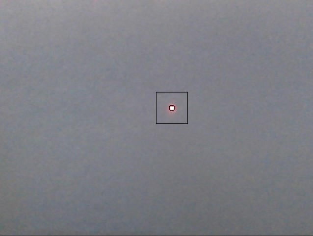
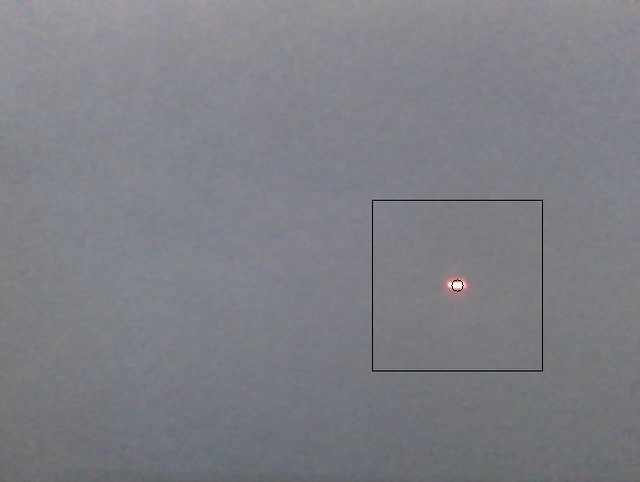
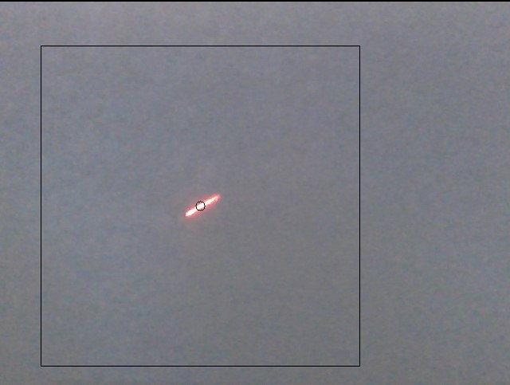

# PredictiveTracking
Object recognition and tracking usually requires application of filters and convolutions on the complete frame. This project implements a spot tracking algorithm that optimizes detection by reducing time complexity and recognizing movement patterns. In the proposed algorithm we minimise the search region to an offset from the current location of the tracked object. The value of the offset also keeps updating based on the history of the tracked object. This includes the successive deviations from its previous location and it's time scale. 

## Implementation

The project is implemented in **Python** using the following libraries:

- **OpenCV** (cv2) - Handles video processing and image analysis.
- **NumPy** - Performs mathematical operations on image data.
- **Pynput** - Manages keyboard event handling.

### Dependencies

Ensure you have the required dependencies installed:

```
pip install opencv-python numpy pynput
```

### Running the Project

Run the Python script to start the tracking process:

```
python brightestSpotTracking.py
```
- Try using a neutral background with a single bright source of light in frame.

  

## Future Enhancements

- Implement noise reduction techniques for better accuracy.
- Extend the algorithm to track multiple objects.

## References

- OpenCV Documentation: [https://opencv.org](https://opencv.org)
- NumPy Documentation: [https://numpy.org](https://numpy.org)

---

Developed as part of the **Digital Signals and System Architecture Lab - ELE551C** course.

**Author**: Pradyumn Agarwal\
**Institution**: Christ (Deemed to be University)\
**Date**: September 27, 2023
